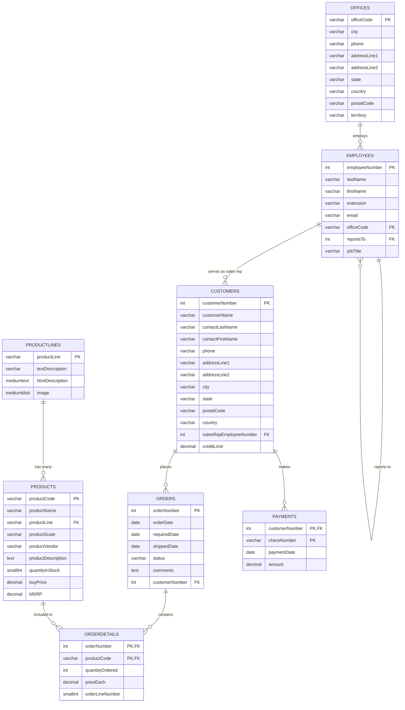

# Classic Models API

A comprehensive Django REST Framework API built on the Classic Models tutorial database, designed for demonstration and learning purposes.

## 🎯 Overview

This is a **demo application** that showcases a complete REST API implementation using Django and Django REST Framework. The application is built on the Classic Models database, which is a well-known sample database used for learning SQL and database design.

### Key Features

- 🗄️ **MySQL Database** with Classic Models sample data
- 🚀 **Django REST Framework** API with full CRUD operations
- 🔐 **JWT Authentication** with user management
- 📚 **Interactive API Documentation** (Swagger/ReDoc)
- 📮 **Complete Postman Collection** with all endpoints and sample data
- 🐳 **Docker & Docker Compose** for easy deployment
- 🏗️ **Production-ready** architecture and best practices
- 🧪 **Comprehensive Test Suite** with 100+ test cases
- 🛠️ **Makefile** for easy development workflow

## 🚀 Quick Start

### Prerequisites

- [Docker](https://docs.docker.com/get-docker/)
- [Docker Compose](https://docs.docker.com/compose/install/)
- [Make](https://www.gnu.org/software/make/) (optional but recommended)

### 1. Clone and Setup

```bash
git clone <repository-url>
cd classic-models-api
```

### 2. Environment Configuration

Create a `.env` file in the root directory:

```env
# Database Configuration
MYSQL_HOST=mysql
MYSQL_PORT=3306
MYSQL_DATABASE=classicmodels
MYSQL_USER=classicuser
MYSQL_PASSWORD=classicpass
MYSQL_ROOT_PASSWORD=rootpassword

# Django Configuration
DEBUG=1
SECRET_KEY=your-secret-key-here-change-in-production
ALLOWED_HOSTS=localhost,127.0.0.1,0.0.0.0

# API Configuration
CORS_ALLOWED_ORIGINS=http://localhost:3000,http://127.0.0.1:3000
```

### 3. Run the Application

#### Option A: Using Make (Recommended)

```bash
# Complete setup with Docker
make setup-docker

# Or step by step
make build          # Build Docker images
make up             # Start services
make db-migrate     # Run migrations
make load-data      # Load sample data
```

#### Option B: Using Docker Compose Directly

```bash
# Start all services
docker-compose up --build

# Or run in background
docker-compose up -d --build
```

### 4. Access the API

- **API Documentation**: http://localhost:8000/api/docs/
- **ReDoc Documentation**: http://localhost:8000/api/redoc/
- **API Base URL**: http://localhost:8000/api/v1/
- **MySQL Database**: localhost:3306
- **Postman Collection**: Import `Classic_Models_API.postman_collection.json` for easy API testing

### 5. Demo User Credentials

- **Username**: `demo`
- **Password**: `demo123`
- **Email**: `demo@classicmodels.com`

## 🗄️ Database Structure

The Classic Models database represents a fictional company that sells classic car models. Here's the complete database schema:




## 🔌 API Structure

### Authentication

The API uses JWT (JSON Web Token) authentication:

```bash
# Login
POST /api/auth/login/
{
  "username": "demo",
  "password": "demo123"
}

# Response
{
  "access": "eyJ0eXAiOiJKV1QiLCJhbGciOiJIUzI1NiJ9...",
  "refresh": "eyJ0eXAiOiJKV1QiLCJhbGciOiJIUzI1NiJ9...",
  "user": { ... }
}
```

### API Endpoints

#### Public Endpoints (No Authentication Required)
- `GET /api/docs/` - Swagger UI documentation
- `GET /api/redoc/` - ReDoc documentation
- `GET /api/schema/` - OpenAPI schema
- `POST /api/auth/login/` - User login
- `POST /api/auth/register/` - User registration
- `POST /api/auth/refresh/` - Token refresh

#### Protected Endpoints (JWT Required)
- `GET /api/auth/me/` - Current user info
- `POST /api/auth/logout/` - User logout

#### Classic Models Data Endpoints

| Resource | Endpoints | Description |
|----------|-----------|-------------|
| **Product Lines** | `/api/v1/classicmodels/productlines/` | Product categories |
| **Products** | `/api/v1/classicmodels/products/` | Product catalog |
| **Offices** | `/api/v1/classicmodels/offices/` | Company offices |
| **Employees** | `/api/v1/classicmodels/employees/` | Staff information |
| **Customers** | `/api/v1/classicmodels/customers/` | Customer data |
| **Orders** | `/api/v1/classicmodels/orders/` | Customer orders |
| **Payments** | `/api/v1/classicmodels/payments/` | Payment records |
| **Order Details** | `/api/v1/classicmodels/orderdetails/` | Order line items |

### Example API Usage

```bash
# 1. Login to get JWT token
curl -X POST http://localhost:8000/api/auth/login/ \
  -H "Content-Type: application/json" \
  -d '{"username": "demo", "password": "demo123"}'

# 2. Use token to access protected endpoints
curl -X GET http://localhost:8000/api/v1/classicmodels/products/ \
  -H "Authorization: Bearer YOUR_ACCESS_TOKEN"

# 3. Get specific product
curl -X GET http://localhost:8000/api/v1/classicmodels/products/S10_1678/ \
  -H "Authorization: Bearer YOUR_ACCESS_TOKEN"

# 4. Create new product
curl -X POST http://localhost:8000/api/v1/classicmodels/products/ \
  -H "Authorization: Bearer YOUR_ACCESS_TOKEN" \
  -H "Content-Type: application/json" \
  -d '{
    "productCode": "S99_9999",
    "productName": "Test Product",
    "productLine": "Classic Cars",
    "productScale": "1:10",
    "productVendor": "Test Vendor",
    "productDescription": "A test product",
    "quantityInStock": 100,
    "buyPrice": "50.00",
    "MSRP": "75.00"
  }'
```

## 📮 Postman Collection

For easy API testing and exploration, we've included a comprehensive Postman collection with all endpoints and sample data.

### Collection Features

- 🔐 **Complete Authentication Flow** - Login, register, token refresh, logout
- 📦 **Full CRUD Operations** - All entities with Create, Read, Update, Delete
- 🎯 **Realistic Sample Data** - Proper field values matching model constraints
- 🔄 **Automatic Token Management** - JWT tokens are automatically extracted and stored
- 📚 **Organized by Resource** - Logical grouping of related endpoints
- 🛠️ **Environment Variables** - Easy configuration for different environments

### Quick Start with Postman

1. **Import the Collection**
   - Download `Classic_Models_API.postman_collection.json` from the project root
   - Import it into Postman

2. **Configure Environment**
   - Set the `base_url` variable to your API URL (default: `http://localhost:8000`)
   - No need to manually set tokens - they're automatically managed

3. **Authentication Flow**
   - Run "Register User" to create a new account (optional)
   - Run "Login User" to authenticate and get JWT tokens
   - All subsequent requests will automatically use the stored access token

4. **Explore the API**
   - Browse through the organized folders for different resources
   - Each folder contains complete CRUD operations
   - Sample data is pre-configured for immediate testing

### Collection Structure

```
Classic Models API
├── Authentication
│   ├── Register User
│   ├── Login User (auto-extracts tokens)
│   ├── Refresh Token
│   ├── Get Current User
│   └── Logout User
├── Product Lines
│   ├── List Product Lines
│   ├── Create Product Line
│   ├── Get Product Line
│   ├── Update Product Line
│   ├── Partial Update Product Line
│   └── Delete Product Line
├── Products
│   ├── List Products
│   ├── Create Product
│   ├── Get Product
│   ├── Update Product
│   ├── Partial Update Product
│   └── Delete Product
├── Offices
│   └── [Complete CRUD operations]
├── Employees
│   └── [Complete CRUD operations]
├── Customers
│   └── [Complete CRUD operations]
├── Orders
│   └── [Complete CRUD operations]
├── Order Details
│   └── [Complete CRUD operations]
├── Payments
│   └── [Complete CRUD operations]
└── API Documentation
    ├── OpenAPI Schema
    ├── Swagger UI
    └── ReDoc
```

### Sample Data Included

The collection includes realistic sample data that matches your model constraints:

- **Products**: Classic car models with proper codes, pricing, and descriptions
- **Offices**: Realistic office locations with complete address information
- **Employees**: Staff records with job titles, extensions, and contact details
- **Customers**: Customer information with credit limits and contact details
- **Orders**: Order data with proper status values and dates
- **Payments**: Payment records with check numbers and amounts

### Environment Variables

The collection uses these variables for easy configuration:

- `{{base_url}}` - API base URL (default: `http://localhost:8000`)
- `{{access_token}}` - JWT access token (auto-managed)
- `{{refresh_token}}` - JWT refresh token (auto-managed)

### Advanced Usage

- **Testing Workflows**: Use Postman's collection runner to test complete workflows
- **Environment Switching**: Create different environments for dev/staging/production
- **Documentation**: Each request includes detailed descriptions and examples
- **Pre-request Scripts**: Automatic token extraction and validation
- **Test Scripts**: Response validation and data extraction


## 🛠️ Development

### Using Make Commands (Recommended)

The project includes a comprehensive Makefile with convenient commands for development:

```bash
# Show all available commands
make help

# Development setup
make setup              # Complete local development setup
make install-dev        # Install development dependencies
make migrate           # Run database migrations
make load-data         # Load sample data
make run               # Start development server

# Testing
make test              # Run all tests
make test-coverage     # Run tests with coverage report
make test-unit         # Run unit tests only
make test-api          # Run API tests only
make test-fast         # Run fast tests (exclude slow ones)

# Code Quality
make lint              # Run linting checks
make format            # Format code with black and isort
make format-check      # Check code formatting

# Docker Development
make setup-docker      # Complete Docker setup
make build             # Build Docker images
make up                # Start services with Docker Compose
make down              # Stop services
make logs              # View service logs
make restart           # Restart services

# Database Management
make db-migrate        # Run migrations in Docker
make db-shell          # Open database shell
make db-backup         # Backup database
make db-reset          # Reset database (WARNING: deletes all data)

# Utilities
make clean             # Clean up temporary files
make health-check      # Check application health
make version           # Show version information
```

### Running Locally (without Docker)

```bash
# Quick setup
make setup

# Or manual setup
make install-dev
make migrate
make load-data
make run
```

### Database Management

```bash
# Using Make commands
make db-shell          # Access MySQL container
make db-backup         # Backup database
make db-reset          # Reset database (WARNING: deletes all data)
make logs-db           # View database logs

# Or using Docker Compose directly
docker-compose exec mysql mysql -u root -p
docker-compose logs mysql
```

## 🧪 Testing

The project includes a comprehensive test suite with 100+ test cases:

```bash
# Run all tests
make test

# Run tests with coverage
make test-coverage

# Run specific test categories
make test-unit         # Model tests only
make test-api          # API tests only
make test-fast         # Exclude slow tests

# Run tests in Docker
make test-docker
make test-coverage-docker
```

### Test Structure

- **Model Tests**: Field validation, relationships, constraints
- **API Tests**: CRUD operations, authentication, validation
- **Integration Tests**: End-to-end API workflows
- **Unit Tests**: Individual component testing

For detailed testing information, see [tests/README.md](tests/README.md).

## 🐛 Troubleshooting

### Using Make Commands

```bash
# Check environment setup
make env-check

# Check application health
make health-check

# View service status
make status

# View logs
make logs              # All services
make logs-api          # API service only
make logs-db           # Database service only

# Restart services
make restart
```

### Common Issues

1. **Port Conflicts**
   ```bash
   # Check if ports are in use
   lsof -i :8000
   lsof -i :3306
   
   # Modify ports in docker-compose.yml if needed
   ```

2. **MySQL Connection Issues**
   ```bash
   # Using Make commands
   make status          # Check service status
   make logs-db         # View database logs
   make restart         # Restart services
   
   # Or using Docker Compose directly
   docker-compose ps
   docker-compose logs mysql
   docker-compose restart
   ```

3. **Permission Denied**
   ```bash
   # Fix file permissions
   sudo chown -R $USER:$USER .
   chmod +x create_demo_user.py
   ```

4. **Test Failures**
   ```bash
   # Run tests with verbose output
   make test-fast -v
   
   # Run specific test
   pytest tests/test_models/test_product.py -v
   
   # Check test coverage
   make test-coverage
   ```

### Demo User Credentials

- **Username**: `demo`
- **Password**: `demo123`
- **Email**: `demo@classicmodels.com`

## 📚 Learning Resources

This demo application demonstrates:

- **Django REST Framework** best practices
- **JWT Authentication** implementation
- **Docker containerization**
- **Database design** with foreign keys
- **API documentation** with OpenAPI/Swagger
- **RESTful API design** principles
- **Comprehensive testing** strategies
- **Development workflow** with Make

### Key Learning Areas

1. **API Development**: Complete REST API with authentication
2. **Database Design**: Complex relationships and constraints
3. **Testing**: Unit tests, integration tests, and API testing
4. **DevOps**: Docker, Make, and development automation
5. **Code Quality**: Linting, formatting, and best practices

## 🚀 Quick Commands Reference

```bash
# Development
make setup              # Complete local setup
make run                # Start development server
make test               # Run all tests
make format             # Format code

# Docker
make setup-docker       # Complete Docker setup
make up                 # Start services
make logs               # View logs
make down               # Stop services

# Database
make db-migrate         # Run migrations
make db-shell           # Access database
make db-backup          # Backup database

# Utilities
make help               # Show all commands
make clean              # Clean up files
make health-check       # Check application health
```

## 🤝 Contributing

This is a demo application for educational purposes. Feel free to fork and modify for your own learning!

### Development Workflow

1. Fork the repository
2. Create a feature branch
3. Make your changes
4. Run tests: `make test`
5. Format code: `make format`
6. Submit a pull request

## 📄 License

This project is for educational and demonstration purposes.
