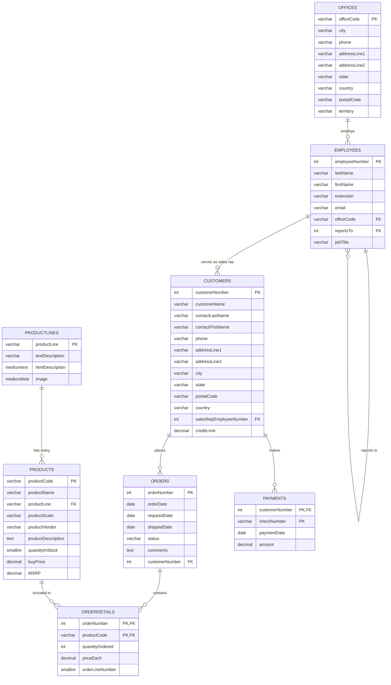

# Classic Models API

A comprehensive Django REST Framework API built on the Classic Models tutorial database, designed for demonstration and learning purposes.

## 🎯 Overview

This demo application showcases a complete REST API implementation using Django and Django REST Framework. Built on the Classic Models database, a well-known sample database used for learning SQL and database design.

### Key Features

- 🗄️ **MySQL Database** with Classic Models sample data
- 🚀 **Django REST Framework** API with full CRUD operations
- 🔐 **JWT Authentication** with user management
- 📚 **Interactive API Documentation** (Swagger/ReDoc)
- 📮 **Complete Postman Collection** with automated testing
- 🐳 **Docker & Docker Compose** for easy deployment
- 🧪 **Comprehensive Test Suite** with 100+ test cases
- 🛠️ **Makefile** for streamlined development workflow

## 🚀 Quick Start

### Prerequisites

- [Docker](https://docs.docker.com/get-docker/)
- [Docker Compose](https://docs.docker.com/compose/install/)
- [Make](https://www.gnu.org/software/make/) (optional but recommended)

### Setup & Run

1. **Clone and Start**
   ```bash
   git clone <repository-url>
   cd classic-models-api
   make start
   ```

   The Docker setup will automatically:
   - Start MySQL database with sample data
   - Wait for database to be ready
   - Run Django migrations
   - Create demo user (username: `demo`, password: `demo123`)
   - Start the Django development server

2. **Access the API**
   - **API Documentation**: http://localhost:8000/classic-models/api/docs/
   - **ReDoc Documentation**: http://localhost:8000/classic-models/api/redoc/
   - **API Base URL**: http://localhost:8000/classic-models/api/v1/
   - **Postman Collection**: Import `Classic_Models_API.postman_collection.json`
   
   Note: The API is served at `/classic-models` base path for all environments.

### Demo Credentials

- **Username**: `demo`
- **Password**: `demo123`
- **Email**: `demo@classicmodels.com`

## 🗄️ Database Structure

The Classic Models database represents a fictional company that sells classic car models. Here's the complete database schema:



## 🔌 API Structure

### Authentication

The API uses JWT (JSON Web Token) authentication:

```bash
# Login
POST /classic-models/api/auth/login/
{
  "username": "demo",
  "password": "demo123"
}

# Response
{
  "access": "eyJ0eXAiOiJKV1QiLCJhbGciOiJIUzI1NiJ9...",
  "refresh": "eyJ0eXAiOiJKV1QiLCJhbGciOiJIUzI1NiJ9...",
  "user": { ... }
}
```

### API Endpoints

#### Public Endpoints (No Authentication Required)
- `GET /classic-models/api/docs/` - Swagger UI documentation
- `GET /classic-models/api/redoc/` - ReDoc documentation
- `GET /classic-models/api/schema/` - OpenAPI schema
- `POST /classic-models/api/auth/login/` - User login
- `POST /classic-models/api/auth/register/` - User registration
- `POST /classic-models/api/auth/refresh/` - Token refresh

#### Protected Endpoints (JWT Required)
- `GET /classic-models/api/auth/me/` - Current user info
- `POST /classic-models/api/auth/logout/` - User logout

#### Classic Models Data Endpoints

| Resource | Endpoints | Description |
|----------|-----------|-------------|
| **Product Lines** | `/classic-models/api/v1/classicmodels/productlines/` | Product categories |
| **Products** | `/classic-models/api/v1/classicmodels/products/` | Product catalog |
| **Offices** | `/classic-models/api/v1/classicmodels/offices/` | Company offices |
| **Employees** | `/classic-models/api/v1/classicmodels/employees/` | Staff information |
| **Customers** | `/classic-models/api/v1/classicmodels/customers/` | Customer data |
| **Orders** | `/classic-models/api/v1/classicmodels/orders/` | Customer orders |
| **Payments** | `/classic-models/api/v1/classicmodels/payments/` | Payment records |
| **Order Details** | `/classic-models/api/v1/classicmodels/orderdetails/` | Order line items |

### Example API Usage

```bash
# 1. Login to get JWT token
curl -X POST http://localhost:8000/classic-models/api/auth/login/ \
  -H "Content-Type: application/json" \
  -d '{"username": "demo", "password": "demo123"}'

# 2. Use token to access protected endpoints
curl -X GET http://localhost:8000/classic-models/api/v1/classicmodels/products/ \
  -H "Authorization: Bearer YOUR_ACCESS_TOKEN"

# 3. Get specific product
curl -X GET http://localhost:8000/classic-models/api/v1/classicmodels/products/S10_1678/ \
  -H "Authorization: Bearer YOUR_ACCESS_TOKEN"

# 4. Create new product
curl -X POST http://localhost:8000/classic-models/api/v1/classicmodels/products/ \
  -H "Authorization: Bearer YOUR_ACCESS_TOKEN" \
  -H "Content-Type: application/json" \
  -d '{
    "productCode": "S99_9999",
    "productName": "Test Product",
    "productLine": "Classic Cars",
    "productScale": "1:10",
    "productVendor": "Test Vendor",
    "productDescription": "A test product",
    "quantityInStock": 100,
    "buyPrice": "50.00",
    "MSRP": "75.00"
  }'
```

## 📮 Postman Collection

For easy API testing and exploration, we've included a comprehensive Postman collection with all endpoints and sample data.

### Quick Start with Postman

1. **Import the Collection**
   - Download `Classic_Models_API.postman_collection.json` from the project root
   - Import it into Postman

2. **Import an Environment**
   
   Choose one of the pre-configured environments:
   
   - **Local Development**: `Classic_Models_API_Local.postman_environment.json`
     - Base URL: `http://localhost:8000/classic-models`
     - For testing with Docker Compose
   
   - **AWS Production**: `Classic_Models_API_AWS.postman_environment.json`
     - Base URL: `https://router.jiridj.be/classic-models`
     - For testing the deployed AWS environment
   
   Both environments use the `/classic-models` base path.
   
   Import your chosen environment file into Postman and select it from the environment dropdown.

3. **Authentication Flow**
   - Run "Register User" to create a new account (optional)
   - Run "Login User" to authenticate and get JWT tokens
   - All subsequent requests will automatically use the stored access token

### Collection Features

- 🔐 **Complete Authentication Flow** - Login, register, token refresh, logout
- 📦 **Full CRUD Operations** - All entities with Create, Read, Update, Delete
- 🎯 **Realistic Sample Data** - Proper field values matching model constraints
- 🔄 **Automatic Token Management** - JWT tokens are automatically extracted and stored
- 📚 **Organized by Resource** - Logical grouping of related endpoints
- 🛠️ **Environment Variables** - Easy configuration for different environments
- 🧪 **Automated Testing** - Run full collection tests with `make postman-test`

### Collection Structure

```
Classic Models API
├── Authentication
│   ├── Register User
│   ├── Login User (auto-extracts tokens)
│   ├── Refresh Token
│   ├── Get Current User
│   └── Logout User
├── Product Lines
│   └── [Complete CRUD operations]
├── Products
│   └── [Complete CRUD operations]
├── Offices
│   └── [Complete CRUD operations]
├── Employees
│   └── [Complete CRUD operations]
├── Customers
│   └── [Complete CRUD operations]
├── Orders
│   └── [Complete CRUD operations]
├── Order Details
│   └── [Complete CRUD operations]
├── Payments
│   └── [Complete CRUD operations]
└── API Documentation
    ├── OpenAPI Schema
    ├── Swagger UI
    └── ReDoc
```

## 🚀 Deployment

For production deployment instructions, including reverse proxy configuration, see [DEPLOYMENT.md](DEPLOYMENT.md).

## 🛠️ Development

### Using Make Commands (Recommended)

The project includes a streamlined Makefile with essential commands:

```bash
# Show all available commands
make help

# Docker Development
make build             # Build Docker containers
make start             # Start containers (database resets to original data)
make stop              # Stop containers

# Testing
make test              # Run test suite
make postman-test      # Run Postman collection tests
make health-check      # Check API health

# Utilities
make clean             # Clean up test result files
```

## 🧪 Testing

The project includes a comprehensive test suite with 100+ test cases:

```bash
# Run all tests
make test

# Run Postman collection tests
make postman-test

# Check API health
make health-check
```

### Test Structure

- **Model Tests**: Field validation, relationships, constraints
- **API Tests**: CRUD operations, authentication, validation
- **Postman Tests**: End-to-end API workflows and integration testing
- **Health Checks**: API endpoint availability verification

## 🐛 Troubleshooting

### Common Issues

1. **Port Conflicts**
   ```bash
   # Check if ports are in use
   lsof -i :8000
   lsof -i :3306
   ```

2. **Service Issues**
   ```bash
   # Check service status
   docker-compose ps
   
   # View logs
   docker-compose logs
   
   # Restart services
   make stop && make start
   ```

3. **Test Failures**
   ```bash
   # Check API health
   make health-check
   
   # Run Postman tests
   make postman-test
   ```

## 📚 Learning Resources

This demo application demonstrates:

- **Django REST Framework** best practices
- **JWT Authentication** implementation
- **Docker containerization**
- **Database design** with foreign keys
- **API documentation** with OpenAPI/Swagger
- **RESTful API design** principles
- **Comprehensive testing** strategies
- **Development workflow** with Make

## 🤝 Contributing

This is a demo application for educational purposes. Feel free to fork and modify for your own learning!

### Development Workflow

1. Fork the repository
2. Create a feature branch
3. Make your changes
4. Run tests: `make test`
5. Submit a pull request

## 📄 License

This project is for educational and demonstration purposes.